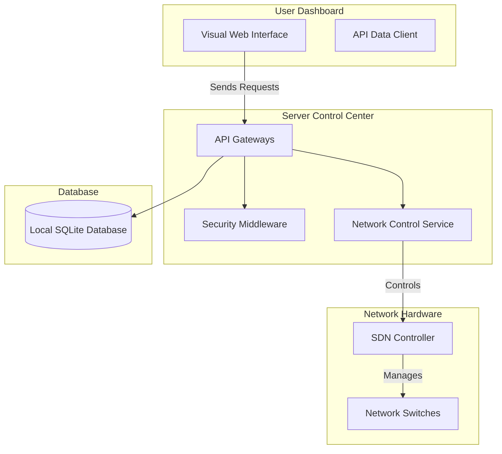

# Apex SDN: System Architecture Overview

This document provides a high-level explanation of how the **Apex SDN** administration and security platform is structured, how it controls the network, and how it is built.

---

## 1. Executive Summary

Apex SDN is an administration and defense dashboard for Software-Defined Networks (SDN). The system allows operators to monitor network traffic in real-time, view the network layout (topology), configure network rules, and trigger security blocks to isolate malicious devices (Intrusion Prevention System).

---

## 2. System Architecture

The platform is designed in three independent layers to ensure high performance and reliability:

*   **User Dashboard (Frontend):** The website the administrator interacts with (charts, maps, logs).
*   **Server Control Center (Backend):** The bridge that receives dashboard actions and translates them into database records or network commands.
*   **Network Hardware:** The actual switches and controller managing network traffic.

---

## 3. Core Software Modules

### 3.1. User Dashboard (React Web App)
*   **Main Application Root (`App.tsx`):** Coordinates views, polls the server for network statistics every 2 seconds, and displays the main dashboard.
*   **Topology Controller (`TopologyControl.tsx`):** Renders a visual map of active switches, lines, and connected devices. Includes controls to isolate a device.
*   **Traffic Analysis (`TrafficAnalysis.tsx`):** Shows graphs detailing throughput, packet rates, and controller saturation.
*   **Log Archive (`LogArchive.tsx`):** Displays historical security alerts and allows administrators to mark warnings as resolved.
*   **System Config (`SystemConfig.tsx`):** Allows configuring connection details, telemetry refresh rates, and security thresholds.

---

## 4. Authentication & Security Access (Demo Mode)

To allow for a frictionless demonstration experience, **access controls are currently bypassed in the code**:

*   **The Bypass Mechanism:** The security checkpoint on the server automatically signs every request in as a mock **"Admin User"** with full **ADMIN** privileges. It does not check for passwords or authorization tokens when commands are run.
*   **Dormant Security Code:** Complete code for user registration, encrypted password storage, and secure token login is already built into the backend, but is currently disconnected so that the demo remains fully unlocked.

---

## 5. Network Traffic Control Mappings

The server translates dashboard button clicks into commands for the network switches:

*   **Viewing Network Devices:** Automatically fetches the list of online switches and maps how they link together.
*   **Adding Routing Rules:** Instructs switches on how to direct traffic (e.g., forwarding data to specific destinations).
*   **Removing Routing Rules:** Revokes existing routing policies on demand.
*   **Isolating Devices (IP Blocking):** When an administrator blocks a device, the system pushes a high-priority block rule to the switches. This rule matches the target's IP address and blocks it from sending or receiving data (dropping all packets).

---

## 6. Database Schema Design

The system saves its operational logs and configurations inside a local database file structured into six main records:

*   **Users:** Stores administrative login details and access levels.
*   **Refresh Tokens:** Manages active secure sessions.
*   **Audit Logs:** Records a chronological list of actions taken (e.g., who blocked an IP, when they logged in, or what rules they created).
*   **Network Events:** Tracks system alerts (e.g., Port Down, DDoS Attack Detected, Host Blocked).
*   **Flow Rules:** Caches active routing rules pushed to the switches.
*   **Blocked Hosts:** Keeps a list of isolated IP addresses, the block reason, and the time they were blocked.

---

## 7. Operational Audit History

The platform records administrative trails to ensure security compliance:
*   **CSV Exports:** Administrators can download complete logs of either network threats or administrative actions as CSV spreadsheet files directly from the dashboard.
*   **Alert Resolution:** Operators can mark alerts as "resolved" or "reopened," updating their status in the database.

---

## 8. Build & Execution Workflow

The project uses a simplified setup to run and package the application:

*   **Development Mode:** Runs both the server backend and the user interface simultaneously. The interface updates instantly in the browser as changes are made.
*   **Production Packaging:** 
    *   Compiles and minifies the web dashboard assets for fast loading.
    *   Packages the backend code into a single executable server file.
    *   Hosts the application locally, serving the dashboard and API under a single port.
*   **Database Seeding:** On startup, the database is automatically filled with sample data (mock events, test switches, and logs) so the application is ready to view immediately.
